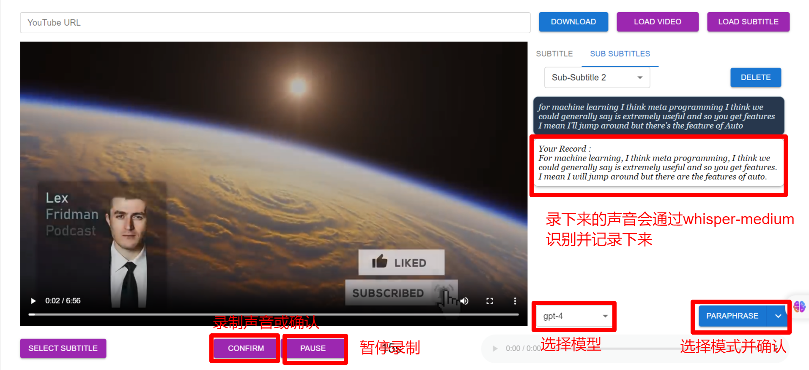

[English](README.md) | [中文](README.zh.md)

# Speakup_v2

 A powerful ai tool combined with youtube to help speaking English.


## Install

You can create a new Anaconda environment named "speakup" with Python version 3.9.16 use the following command:

`conda create -n speakup python=3.9.16`

Then, run `activate speakup` to activate the environment

Finally,  install the necessarily package

```
cd client
npm install
```

```
cd server
pip install -U -r requirements.txt
```

## Sound eXchange Install

To convert various formats of computer audio files in to other formats, you need download the SoX using this [link](https://sox.sourceforge.io/).

## FFmpeg Install

In order to handle audio files, you need download the FFmpeg using this [link](https://ffmpeg.org/).
Then, you should add the location of the downloaded file to the system path.

## Ngrok Install and Config

You can download the ngrok using this [link](https://ngrok.com/download).

Then, you should add the location of the downloaded file to the system path.

config the ngrok setting(`C:\Users`\\`<user>\AppData\Local\ngrok\ngrok.yml`)

```
authtoken: yourTokenHere
tunnels:
	first:
		addr: 8000
		proto: http
	second:
		addr: 3000
		proto: http
```

After saving the file, run the following command:

`ngrok start --all`

## Start

If you run the software using ngrok, you can use the software on your mobile, just double click the bash file: `start all.ps1`

If you just want run the software on your own PC device, you can dould click the bash file: `start.bat`

## Access tokens

access tokens place: *[https://chat.openai.com/api/auth/session](https://chat.openai.com/api/auth/session)*
Get it and replace it in `server\config.json`

## Prompts

You can use your own prompts by changing `client\src\assets\data\config_data.json`

## User Guide




***Currently, this program only supports Windows. If you encounter any issues, please feel free to raise them in the issues section. If you find it helpful, please recommend it to your friends and don't forget to star it. This would be the greatest support for me.***
