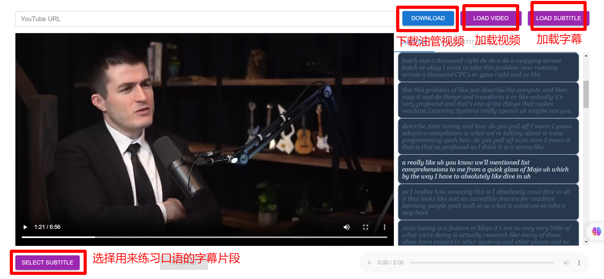
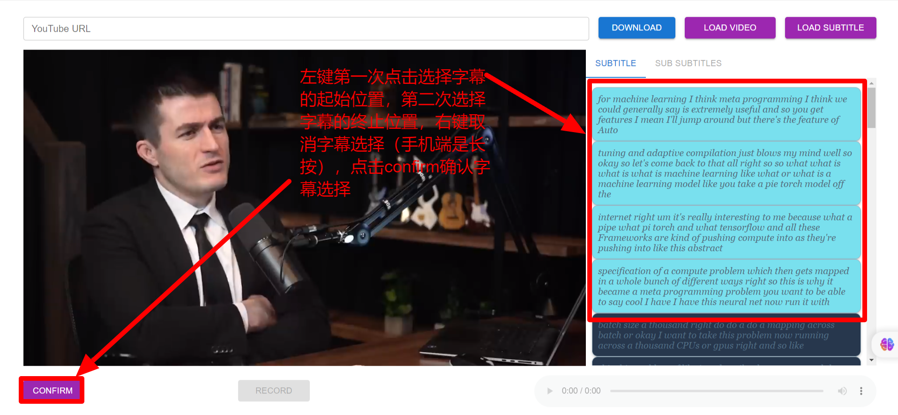
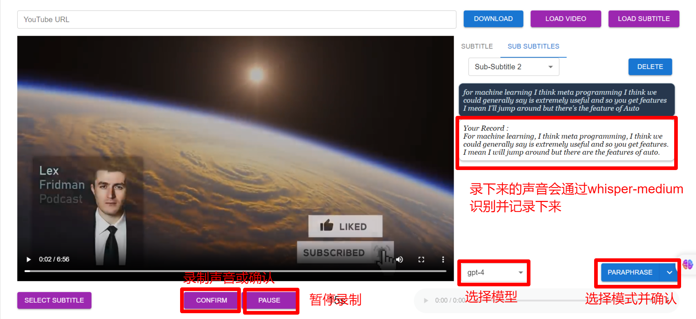

[English](README.md) | [中文](README.zh.md)

# Speakup

结合 YouTube 的强大 AI 工具，帮助提高英语口语能力。

## 安装

你可以使用以下命令创建一个名为 "speakup" 的 Anaconda 环境，并使用 Python 版本 3.9.16：

`conda create -n speakup python=3.9.16`

然后，运行 `activate speakup` 来激活该环境。

最后，安装必要的软件包：

```
cd client
npm install

cd server
pip install -U -r requirements.txt
```

## 安装 Sound eXchange

为了将计算机音频文件从一种格式转换为另一种格式，你需要使用此[链接](https://sox.sourceforge.io/)下载 SoX并安装。

## 安装 FFmpeg

为了处理音频文件，你需要使用此[链接](https://ffmpeg.org/)下载 FFmpeg并解压。

然后，将解压后的文件路径添加到系统路径中。

## 安装并配置 Ngrok

你可以使用此[链接](https://ngrok.com/download)下载 Ngrok。

然后，将下载的文件路径添加到系统路径中。

配置 Ngrok 设置(`C:\Users`\\`<user>\AppData\Local\ngrok\ngrok.yml`)：

```
authtoken: yourTokenHere
tunnels:
	first:
		addr: 8000
		proto: http
	second:
		addr: 3000
		proto: http
```

保存文件后，运行以下命令：

`ngrok start --all`

## 启动

如果你使用 ngrok 运行软件，你可以在手机上使用该软件，只需双击 bash 文件：`start all.ps1`

如果你只想在自己的电脑上运行软件，只需双击 bash 文件：`start.bat`

## 访问令牌（Access tokens）

访问令牌链接：*[https://chat.openai.com/api/auth/session](https://chat.openai.com/api/auth/session)*
获取"accessToken"并替换 `server\config.json` 中的内容。

## 提示词（Prompts）

你可以通过修改 `client\src\assets\data\config_data.json` 来定制自己的提示词。

## 使用说明







***目前本程序只支持Windows，如果你发现了问题，欢迎在issues中提出，如果你觉得好用，请把它推荐给你的好友，同时不要忘记star，这是对我最大的支持。***
